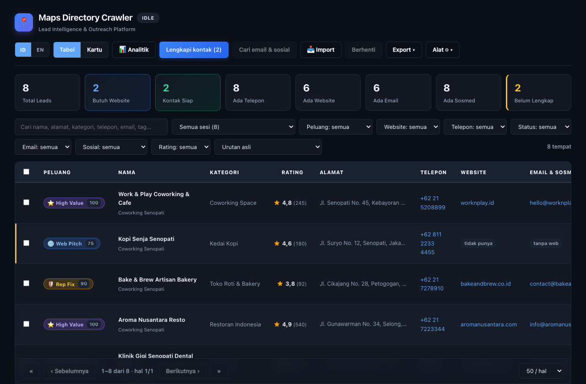
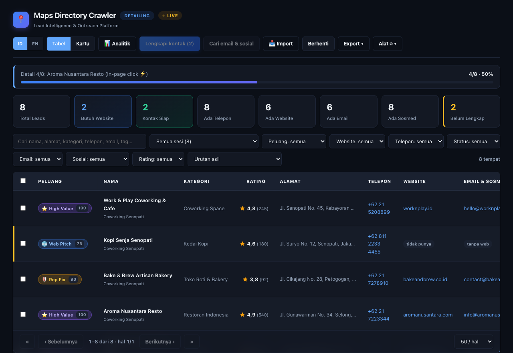
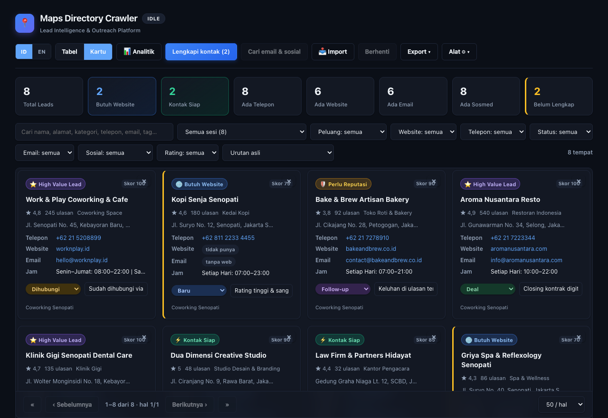
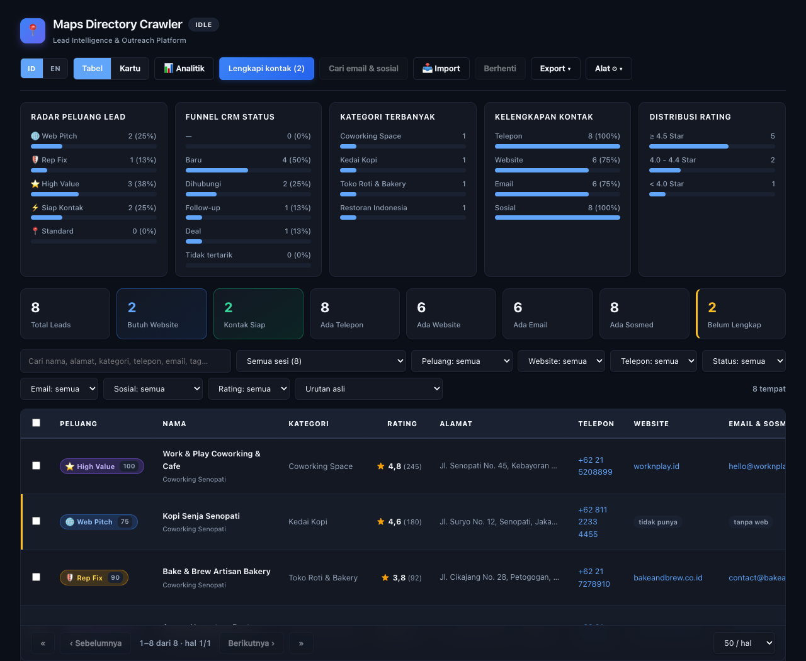
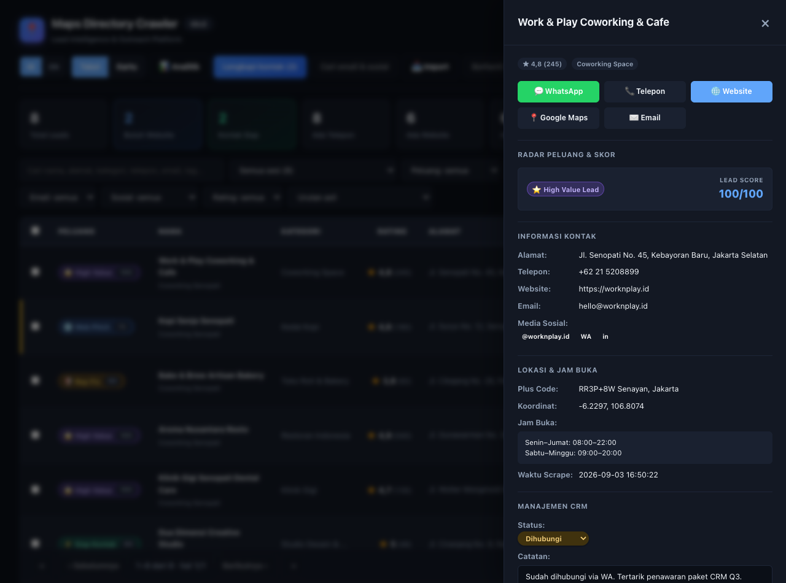
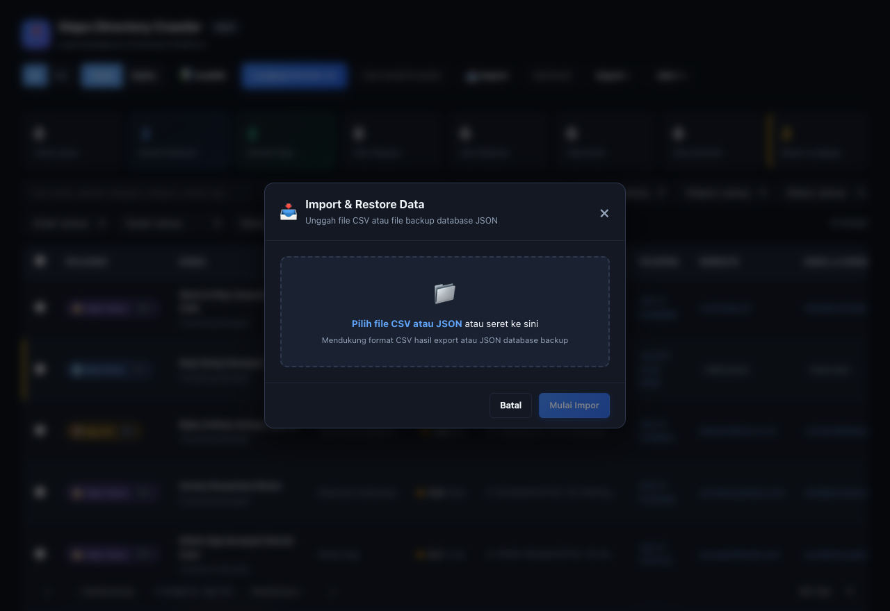

# Maps Directory Crawler

Chrome Extension (Manifest V3) untuk memanen daftar tempat dari hasil pencarian Google Maps menjadi prospek bisnis siap kontak, dilengkapi dengan analisis peluang lead otomatis, CRM ringan, ekstraksi email & media sosial, serta analitik visual.



---

## Fitur Utama

- ⚡ **In-Page Detail Click (Ultra-Fast)** — Membuka panel detail Google Maps langsung di panel samping tanpa reload tab. Scraping kontak menjadi **4x–5x lebih cepat** (hanya ~0,6–0,8 detik/tempat).
- 🌐 **Bilingual UI (ID / EN)** — Mendukung Bahasa Indonesia dan English secara instan dengan peristilahan modern dan natural.
- 🎯 **Radar Peluang Lead (Opportunity Scoring)** — Mengklasifikasikan prospek secara otomatis (Web Pitch, Reputation Fix, High Value Lead, Outreach Ready) beserta **Lead Score (0–100)**.
- 📊 **Analitik Visual (5 Bagan Statistik)** — Visualisasi sebaran peluang, funnel status CRM, kategori teratas, tingkat kelengkapan kontak, dan distribusi rating.
- 📑 **Quick Detail Drawer** — Panel samping informatif dengan tombol cepat WhatsApp, Telepon, Google Maps, editor Catatan & Tag kustom, jam buka, koordinat, dan waktu scrape presisi.
- 📌 **Sticky Table Header & Sticky Pagination** — Header tabel tetap terkunci di atas dan pagination menempel rapi di bagian bawah, hanya baris data yang bergulir.
- 📥 **Import & Backup/Restore (CSV/JSON)** — Unggah kembali file CSV atau file backup database JSON dengan opsi Smart Merge atau Replace All (Restore).
- 🧹 **Pembersih Duplikat (Deduplicate)** — Menggabungkan otomatis entri ganda yang memiliki nomor telepon sama.
- ⏱️ **Tracking Waktu (`scrapedAt`)** — Riwayat tanggal dan jam kapan tempat di-scrape secara presisi tercatat di database dan seluruh format export.

---

## Pasang

1. Buka `chrome://extensions` di Google Chrome.
2. Aktifkan **Developer mode** (di pojok kanan atas).
3. Klik **Load unpacked** → pilih folder `gmaps-crawler`.

## Cara Mengoperasikan di Google Maps

Ikuti alur pengoperasian berikut saat berada di Google Maps:

```
[Buka Google Maps & Cari] ➔ [Klik Ikon Ekstensi] ➔ [Atur Target & Klik Mulai] ➔ [In-Page Click Detail Otomatis] ➔ [Buka Dashboard]
```

1. **Lakukan Pencarian di Google Maps**:
   - Buka **[maps.google.com](https://www.google.com/maps)**.
   - Ketik kata kunci bisnis sasaran Anda (contoh: `kafe di senopati jakarta`, `klinik gigi bandung`, `restoran surabaya`).
   - Tekan Enter sampai daftar tempat muncul di **panel sebelah kiri** Google Maps.
2. **Buka Popup Ekstensi**:
   - Klik ikon **Maps Directory Crawler** di toolbar Chrome (kanan atas browser).
   - Atur **Maks. tempat** (misal: `30` atau `50`).
   - Biarkan **Jeda detail** di angka `800` ms (sudah sangat pas dan natural).
   - Pastikan centang **Ambil kontak (telepon, web, jam)** aktif.
3. **Klik Mulai**:
   - Sistem akan langsung mengendalikan tab Google Maps secara otomatis:
     - **Fase 1 (Kumpul List)**: Script men-scroll panel hasil kiri untuk memuat tempat-tempat baru.
     - **Fase 2 (In-Page Click Detail ⚡)**: Script mengklik kartu tempat satu demi satu di panel kiri tanpa reload tab. Panel detail kanan Google Maps terbuka instan (~0,6 detik/tempat) untuk membaca nomor telepon, website, jam buka, foto, dan koordinat.
4. **Pantau Live di Dashboard**:
   - Klik tombol **Lihat Dashboard →** di popup kapan saja. Progres scraping berjalan secara live:



> 💡 **Tips Pengoperasian:**
> - Biarkan tab Google Maps tetap terbuka selama proses scraping berlangsung.
> - Jendela kecil popup ekstensi boleh Anda tutup, crawl akan terus berjalan di background service worker.
> - Untuk mencoba dashboard tanpa membuka Google Maps, Anda dapat membuka `dashboard.html?running=1` untuk melihat simulasi crawl interaktif.

---

## Dashboard Pro & Galeri Fitur

Tombol **Lihat Dashboard →** di popup membuka dashboard interaktif lengkap:

### 1. Tampilan Tabel & Kartu (Table & Cards View)
Mendukung dua mode tampilan dengan preferensi tersimpan di storage lokal:
- **Tabel**: Tampilan padat dengan header sticky kontras tinggi, zebra striping, dan tombol sort kolom.
- **Kartu**: Tampilan kartu visual yang lapang dan nyaman dibaca satu per satu.



---

### 2. Radar Peluang Lead (Lead Opportunity Scoring)
Analisis otomatis setiap profil prospek berdasarkan kelengkapan digital:
- 🌐 **Butuh Website (Web Pitch)**: Bisnis aktif / rating bagus tapi belum memiliki website (target agensi web / digital marketing).
- 🛡️ **Perlu Reputasi (Rep Fix)**: Rating < 4,0 dengan ulasan aktif (target konsultan reputasi / customer satisfaction).
- ⭐ **High Value Lead**: Rating ≥ 4,5 dan ulasan banyak (bisnis mapan, potensi anggaran besar).
- ⚡ **Kontak Siap (Outreach Ready)**: Telepon dan email terverifikasi, siap dihubungi secara omnichannel.
- 📈 **Lead Score (0–100)**: Skor komprehensif mengukur kelayakan prospek untuk segera dihubungi.

---

### 3. Analitik Visual (📊 Analitik)
Panel grafik visual interaktif yang menampilkan 5 bagan statistik penting:
1. **Radar Peluang Lead**: Sebaran prospek berdasarkan tipe peluang bisnis.
2. **Funnel CRM Status**: Alur konversi prospek (Baru ➔ Dihubungi ➔ Follow-up ➔ Deal / Tidak Tertarik).
3. **Kategori Terbanyak**: Distribusi jenis usaha teratas.
4. **Kelengkapan Kontak**: Persentase kepemilikan Telepon, Website, Email, dan Media Sosial.
5. **Distribusi Rating**: Proporsi rating bintang (≥ 4.5, 4.0–4.4, dan < 4.0).



---

### 4. Quick Detail Drawer
Klik nama tempat mana pun untuk membuka panel laci samping (*slide-over*) yang kaya informasi:
- **Aksi Cepat 1-Klik**: Tombol instan WhatsApp (`wa.me`), Telepon (`tel:`), Website, Google Maps, dan Email.
- **Ringkasan Skor**: Badge peluang visual dan skor lead 0–100.
- **Info Lengkap**: Alamat, jam buka detail, Plus Code, koordinat GPS, dan waktu scrape presisi.
- **Manajemen CRM**: Ubah status prospek, tulis catatan prospek (*auto-save on blur*), dan input tag kustom.



---

### 5. Import & Backup/Restore (CSV/JSON)
Dialog modal impor serbaguna dengan area *drag-and-drop*:
- **Smart Merge**: Menambahkan tempat baru ke database tanpa menghapus catatan atau status CRM yang sudah ada.
- **Restore Database**: Memulihkan database lengkap dari file cadangan JSON (`.json`).
- **Backup Database**: Mengunduh seluruh basis data dan riwayat sesi dalam satu file JSON terstruktur via menu *Alat ⚙ ▾*.



---

### 6. Cari Email & Media Sosial
Tombol **Cari email & sosial (N)** membuka website tiap tempat di tab tersembunyi, lalu mencari alamat email serta akun media sosial di halaman depan dan `/contact`, `/kontak`, `/about`:
- Penyaringan cerdas: Membuang email vendor/template (`sentry.io`, `noreply@`, `wixpress`) dan memprioritaskan email dengan domain yang sama dengan website.
- Akun media sosial yang didukung: **Instagram, WhatsApp (`wa.me`), Facebook, LinkedIn, TikTok, X (Twitter)**, ditampilkan sebagai badge berwarna yang langsung dapat diklik.

---

### 7. Multi-select & Batch Actions
- Centang beberapa baris tempat untuk melakukan:
  - **Ubah Status Massal**: Mengubah status prospek sekaligus (misal ke *Dihubungi* atau *Follow-up*).
  - **Hapus Terpilih**: Membersihkan prospek yang tidak relevan secara serentak.
  - **Export Terpilih**: Mengunduh hanya baris yang dipilih ke CSV.

---

## Penyimpanan & Sistem Anti-Duplikasi

Data disimpan di `chrome.storage.local` dan **tidak pernah hilang** saat crawl baru dijalankan:

1. **Unique Google Maps Place ID**: Setiap tempat diidentifikasi menggunakan token permanen internal Google Maps (`!1s0x...`). Crawl ulang dengan kata kunci berbeda tidak akan menghasilkan duplikat.
2. **Merge Idempoten**: Nilai yang sudah terisi tidak akan tertimpa oleh nilai kosong saat crawl baru. Catatan manual dan status CRM selalu dipertahankan.
3. **Pembersih Duplikat No. Telepon**: Fitur *Alat ⚙ ▾ ➔ 🧹 Merge Duplikat* mendeteksi nomor telepon yang sama (≥7 digit) dan menggabungkannya ke baris paling lengkap.

---

## Kolom Data

File export (CSV, Excel `.xls`, JSON, TSV) mencakup 23 kolom lengkap:

```
name, category, rating, reviews, address, phone, website, hasWebsite,
email, emailsAll, socials, imageUrl, hours, plusCode, lat, lng,
status, note, tags, opportunity, leadScore, scrapedAt, url
```

---

## Arsitektur Modular

Sistem dibangun dengan prinsip *Clean Separation of Concerns* (100% native Chrome MV3 tanpa ketergantungan bundler):

| File | Peran |
|---|---|
| `manifest.json` | Manifest V3, perizinan host dibatasi ke Google Maps |
| `content.js` | Content script: pengumpulan feed (`COLLECT`) & detail in-page click (`CLICK_AND_SCRAPE_DETAIL`) |
| `background.js` | Service worker: crawler engine, navigasi tab, state machine, deduplikasi, import/restore |
| `i18n.js` | Kamus bilingual (ID/EN), helper terjemahan `t()`, dan lokalisasi UI |
| `analytics.js` | Engine visualisasi 5 bagan analitik |
| `drawer.js` | Controller panel samping Quick Detail Drawer dan pintasan aksi cepat |
| `import-modal.js` | Controller dialog modal dropzone drag-and-drop file CSV & JSON |
| `opportunity.js` | Mesin Lead Opportunity Scoring (Web Pitch, Rep Fix, High Value, Outreach Ready) & skor (0–100) |
| `import.js` | Parser RFC 4180 CSV, parser JSON database backup, validasi schema & normalisasi |
| `export.js` | Formatter export CSV, Excel (.xls), JSON, TSV, dan backup database |
| `email.js` | Engine pencari email & media sosial dari website tempat |
| `dashboard.html/css/js` | UI dashboard utama, styling modern glassmorphism, filter, tabel & pagination |
| `popup.html/css/js` | Popup ekstensi: kontrol mulai/berhenti crawl, input pengaturan, dan progress bar |
| `test/` | Rangkaian pengujian unit otomatis tanpa browser (`./test/run.sh`) |

---

## Pengujian Unit

Jalankan seluruh pengujian unit otomatis via shell:

```sh
./test/run.sh
```

**123 Unit Tests Lolos 100%**, mencakup:
- Lead Opportunity Scoring & kalkulasi skor 0–100
- Integritas dan kelengkapan kamus bilingual i18n
- RFC 4180 CSV parser & netralisasi formula injection Excel
- Backup database JSON parser & validasi skema
- Pemeringkatan dan ekstraksi email cerdas
- Ekstraksi media sosial (Instagram, WA, FB, LinkedIn, TikTok, X)
- Dedup lintas sesi dan kekekalan anotasi CRM
- Aritmetika pagination responsif & pemangkasan halaman
- Format nomor telepon, rating (id-ID & en-US), dan koordinat geo

---

## Legal & Batasan

Google Maps tidak menyediakan API DOM publik; atribut scraping dapat berubah sewaktu-waktu oleh Google. Ekstensi ini ditujukan untuk riset, edukasi, dan pemakaian internal berskala wajar. Untuk kebutuhan komersial skala besar, disarankan menggunakan [Google Maps Places API](https://developers.google.com/maps/documentation/places/web-service) resmi. Penggunaan data kontak wajib mematuhi UU Pelindungan Data Pribadi (UU PDP) / GDPR.
